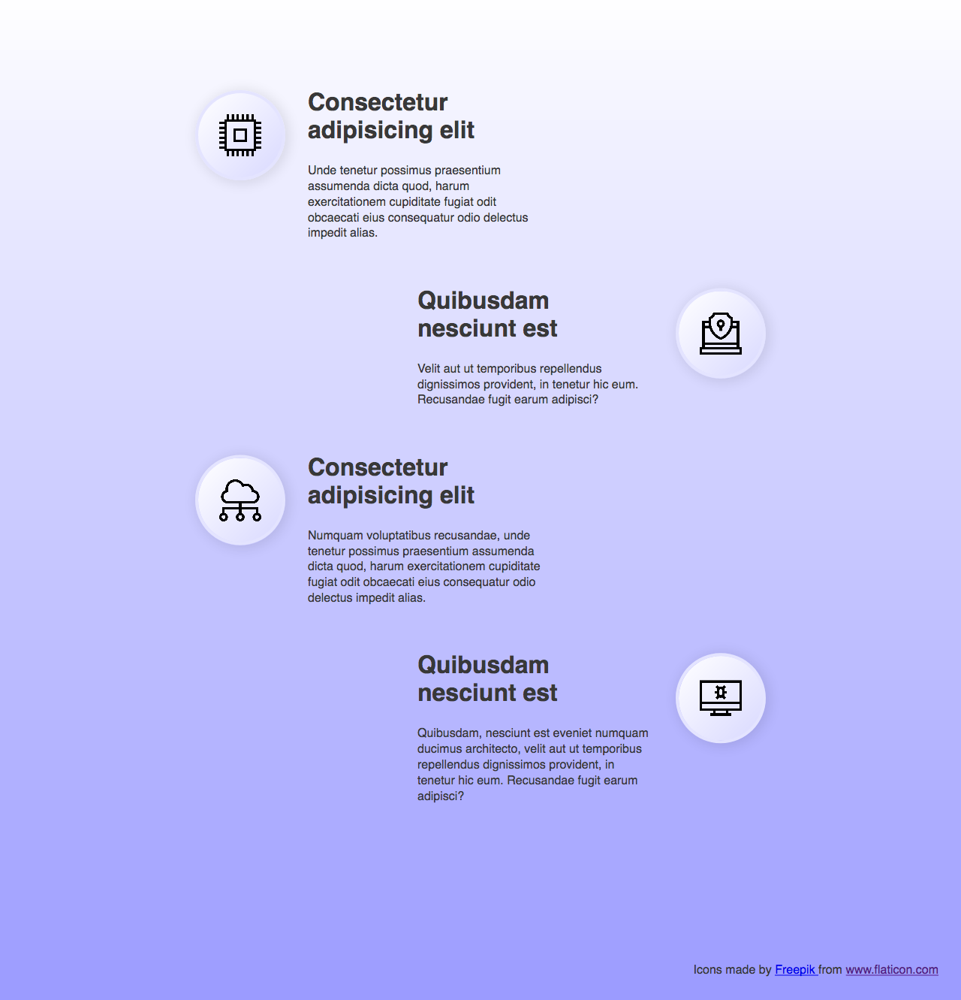
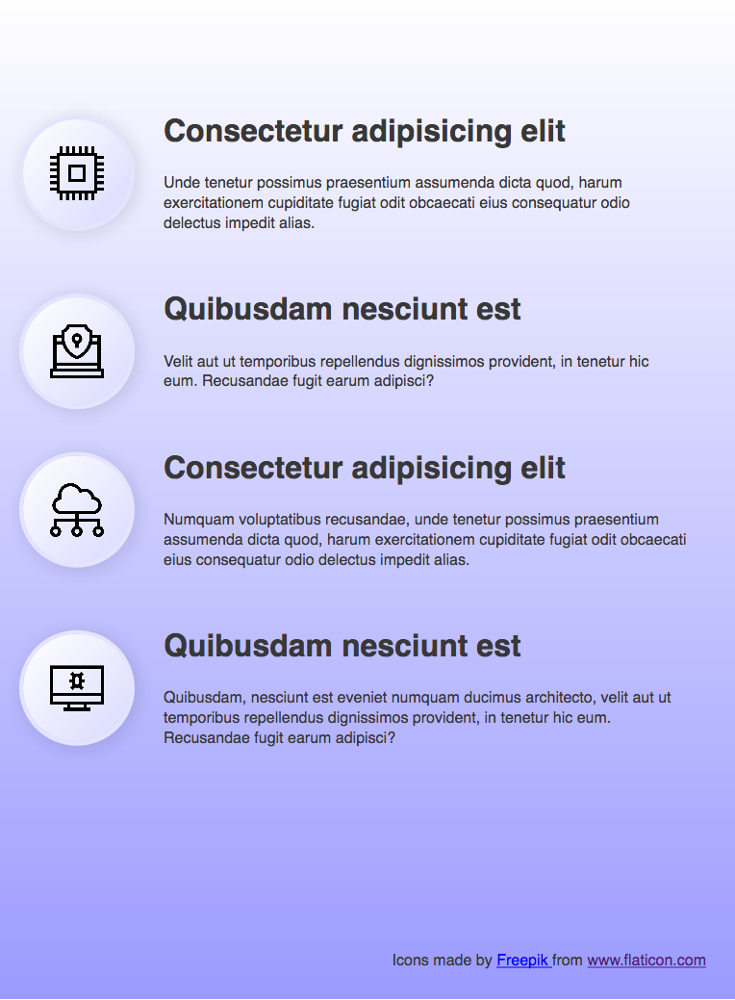
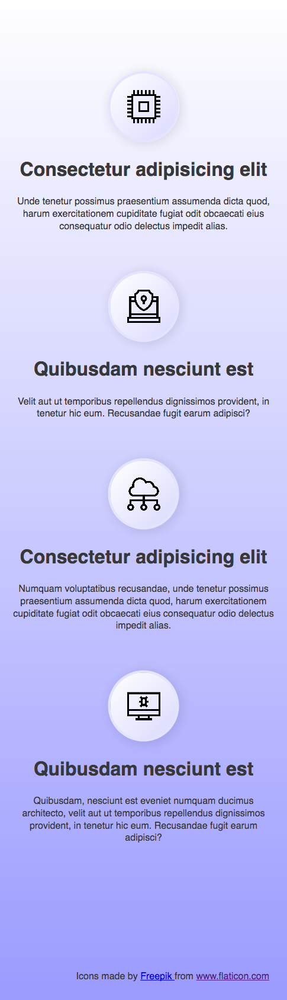

# KPI list

Let's create a reposnive list of key points of interest (KPI).

The entire list should be centered on the screen.

Each item in the list displays an icon (you can find the icons inside the images fodler).

Take a look at the example:



## Tablet

Now, let's adapt the list to look like the example on tablet:



## Mobile

On mobile, the list should look like this:



## Icons attribution

Let's add links attribution at the bottom of the list.

```html
<p>
    Icons made by 
    <a href="https://www.flaticon.com/authors/freepik" title="Freepik">
        Freepik
    </a> from 
    <a href="https://www.flaticon.com/" title="Flaticon">
        www.flaticon.com
    </a>  
</p>
```
